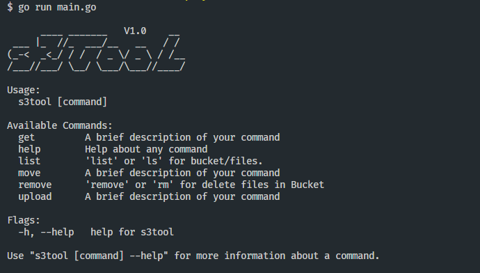

# S3Tool
---
Este é um projeto em Go que fornece uma interface de linha de comando (CLI) para interagir com o Amazon S3.

### Comandos
- list: 100% funcional
- remove: 100% funcional
- get: 100% funcional
- find: em desenvolvimento
- move: em desenvolvimento
- upload: em desenvolvimento

### Dependências
Este projeto depende das seguintes bibliotecas:

- `github.com/aws/aws-sdk-go-v2/service/s3`: SDK da AWS para Go. Usado para interagir com o Amazon S3.
- `github.com/edwinbustillos/s3tool/awsconfig`: Módulo de configuração AWS para este projeto.
- `github.com/xlab/treeprint`: Usado para imprimir a estrutura de diretórios em formato de árvore.

### Como executar
1. Clone o repositório.
```bash
git clone https://github.com/edwinbustillos/s3tool.git
```
2. Instale as dependências com `go get` ou `go mod download`.
3. Defina as variáveis de ambiente necessárias no arquivo config.yaml (veja a seção 'Arquivo configuração' abaixo).
4. Execute o programa com `go run main.go`.
5. Compile com `go build -o s3tool.exe`

### Arquivo configuração `config.yaml`
Este arquivo é gerado automaticamente caso não exista na raiz da aplicação.

```
KEY: 
SECRET: 
REGION: us-east-1
```

### Imagens
---


### Contribuindo
Contribuições ou sugestões são bem-vindas! entre em contato ou por favor, abra um issue ou pull request.

### Licença
Este projeto está licenciado sob a licença MIT.
